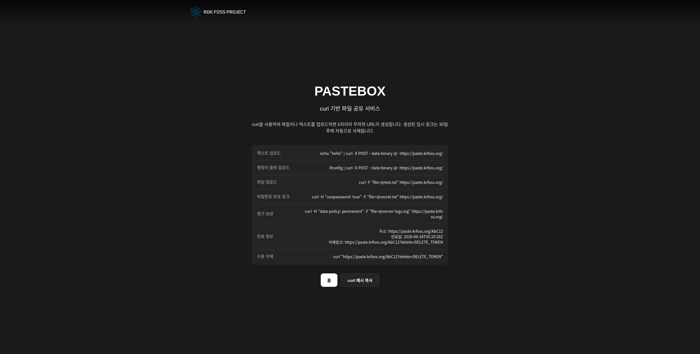

# Pastebox
curl 기반 파일 공유 서비스

[English](./README.md) | Korean



### 기술 스택
| 레이어 | 스택 |
|--------|------|
| OS | Alpine Linux 3.23.4 (미러: https://mirror5.krfoss.org/alpine)|
| 언어 | Go |
| 프론트엔드 | Go HTML Template |
| 백엔드 | Go Standard Library HTTP Server |
| 저장소 | Local File Storage / MariaDB (선택 가능) |
| 압축 기술 | zstd / gzip (DB 모드 시 사용 가능) |

### 어떻게 사용하나요?
1. 저장소를 클론하거나 `.zip` 파일로 다운로드하세요.
2. `config.example.conf` 파일을 복사하여 `config.conf` 설정 파일을 만듭니다.
   ```bash
   cp config.example.conf config.conf
   ```
3. 로컬 파일 저장소 모드로 가볍게 실행할지, 대규모 처리를 위해 MariaDB 모드를 활성화할지 `config.conf`를 수정하여 선택합니다.
4. 로컬에서 실행합니다:
   ```bash
   go build -o pastebox ./cmd/server
   ./pastebox
   ```
   *(또는 docker compose 빌드를 원하시면 `docker compose up -d --build`로 실행할 수 있습니다.)*
5. `http://localhost:8080`을 브라우저에서 접속하거나 `curl`을 사용하여 파일을 업로드하세요.

---

### 설정 가이드 (`config.conf`)
Pastebox는 런타임에 로컬 파일 및 데이터베이스 모드를 전환할 수 있도록 `key=value` 프로퍼티 형식의 `.conf` 파일을 지원합니다.

```ini
# 저장소 모드 (local: 로컬 파일 저장, db: MariaDB/MySQL 연동)
STORAGE_MODE=local

# 서버 대기 주소
LISTEN_ADDR=:8080

# [Local 모드 전용] 파일이 물리적으로 저장될 경로
DATA_DIR=./data

# 임시 파일 자동 만료 기간 (일)
EXPIRE_DAYS=30

# [DB 모드 전용] MariaDB DSN 연결 정보 (자동으로 테이블 생성 및 관리)
DB_DSN=root:password@tcp(127.0.0.1:3306)/pastebox?parseTime=true

# [DB 모드 전용] 데이터 초고압축 알고리즘 (zstd, gzip, none 중 선택)
DB_COMPRESSION_ALGORITHM=zstd

# [선택] 관리자 로그인 마스터 토큰 (비워둘 시 최초 서버 기동 시 256자 임의 토큰을 자동 생성해 채워넣습니다)
ADMIN_TOKEN=
```

---

### 기능

1. **파일 자동삭제**: 업로드 시점 기준 30일 후 자동삭제 (백그라운드 정리 고루틴 기동)

2. **텍스트 업로드**: **echo, cat (cat << EOF)**와 같이 리눅스 명령어와 연계하여 업로드 가능
   ```bash
   echo "hello" | curl -X POST --data-binary @- http://localhost:8080/
   ```

3. **명령어 출력 업로드**: 서버 로그나 시스템 현황(`ifconfig`, `df -h` 등) 결과를 직접 파이프로 연결하여 다이렉트 업로드 가능
   ```bash
   ifconfig | curl -X POST --data-binary @- http://localhost:8080/
   ```
   
4. **파일 업로드**: `multipart/form-data` 형식의 파일 업로드 지원
   ```bash
   curl -F "file=@test.txt" http://localhost:8080/
   ```

5. **영구 저장**: `data-policy: permanent` 헤더를 사용한 영구 저장 지원
   ```bash
   curl -H "data-policy: permanent" -F "file=@test.txt" http://localhost:8080/
   ```
   
6. **비밀번호 링크**: `usepassword: true` 헤더를 사용한 비공개 업로드 링크생성 지원 (헤더 사용시 **영문(대+소문자) + 숫자 + 특수문자** 조합으로 생성된 8자리 비밀번호 발급 및 `?password=...` 혹은 `paste-password: ...` 헤더로 접근 가능)
   ```bash
   # 비밀번호 링크 생성:
   curl -H "usepassword: true" -F "file=@secret.txt" http://localhost:8080/
   
   # 파일 확인:
   curl -H "paste-password: RANDOM_PASSWORD" http://localhost:8080/RANDOM_CODE

   curl http://localhost:8080/RANDOM_CODE?password=RANDOM_PASSWORD
   ```

7. **대규모 압축 인메모리 파이프라인 (DB 모드)**:
   - 데이터베이스 연동 시, 업로드한 데이터를 Go 백엔드 메모리 단에서 `zstd` 또는 `gzip`을 통해 초고압축하여 DB에 축소 보관합니다.
   - 이를 통해 디스크 용량을 최대 90% 이상 절감하며 디스크 I/O와 대역폭 사용을 최소화하여 조회가 급증하는 환경에서도 빠른 응답 속도를 냅니다.

8. **관리 대시보드 (`/ra`)**:
   - 관리자가 업로드된 모든 paste 데이터를 웹 브라우저에서 편리하게 관리할 수 있는 `/ra` 모니터링 콘솔을 제공합니다.
   - `ADMIN_TOKEN`을 통해 안전하게 인증(쿠키 기반) 후 접근하며, **선택 삭제** 및 **전체 파기** 기능을 지원합니다.
   - 최초 기동 시 `ADMIN_TOKEN` 설정이 비어있다면 영문 대소문자 및 숫자 조합의 256자 마스터 토큰이 자동으로 생성되어 `config.conf`에 영구 보존됩니다. (최초 생성 시 서버 표준 출력 로그를 통해 토큰 정보를 확인할 수 있습니다.)

---

### 디렉토리 구조
```text
pastebox/
├── config.conf             # [NEW] 로컬 실행용 설정 파일 (Git 제외)
├── config.example.conf     # [NEW] 설정 파일 템플릿 예시
├── Dockerfile
├── docker-compose.yml
├── docker-entrypoint.sh
├── go.mod
├── go.sum
├── README.md
├── README_ko.md
├── cmd/
│   └── server/
│       └── main.go
├── internal/
│   ├── metadata.go
│   ├── store.go
│   └── store_test.go       # [NEW] 동시성 스트레스 및 단위 테스트
└── templates/
    └── index.html
```
